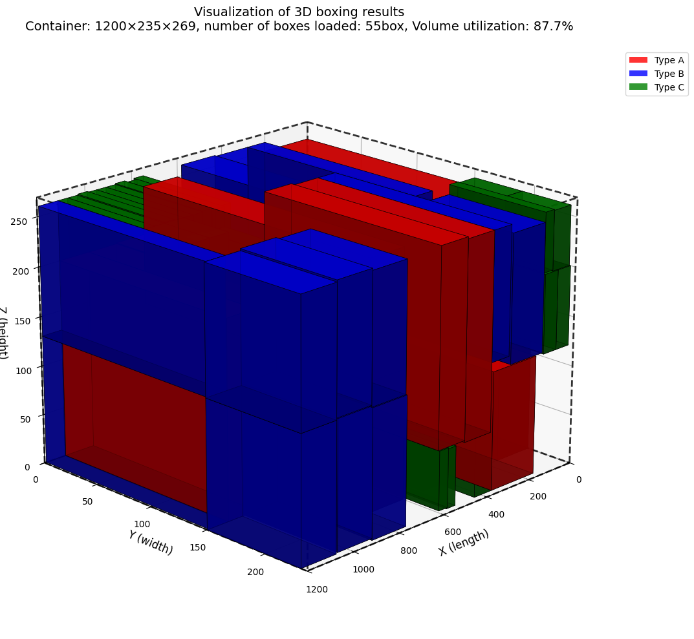
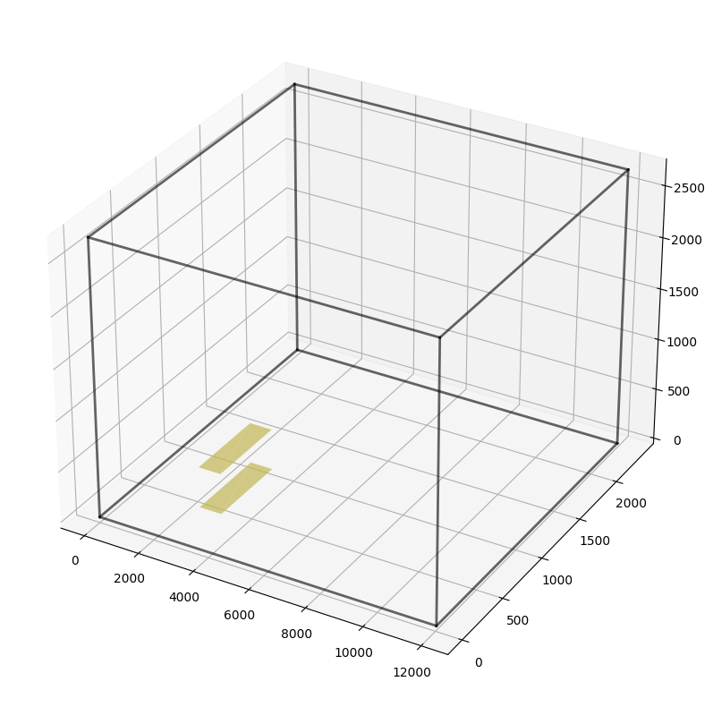

# 3D Container Loading Optimization

A reproducible research and engineering framework for axis-aligned 3D container loading. The repository combines canonical instance and solution formats, independent geometric validation, deterministic Greedy policies and portfolios, OR-Tools CP-SAT optimization, a local desktop GUI, and controlled benchmark experiments.

The project studies solution quality and solver/search behavior separately. It includes deterministic internal benchmarks, fixed-seed distributional benchmarks, and external Bischoff-Ratcliff instances from OR-Library.

> **Status:** active experimental framework. The validated Greedy Portfolio-IG, normal CP-SAT solver, validator, benchmark infrastructure, and GUI are usable. Research switches and notebooks have the narrower statuses documented below.



## Problem and canonical data

Given a rectangular container and candidate rectangular boxes, select boxes, orientations, and integer `(x, y, z)` coordinates so that every selected box stays inside the container and no two boxes overlap. The default objective is maximum packed volume.

Canonical JSON schemas define:

- container dimensions;
- box type and physical box identities, dimensions, quantities, and allowed axis-aligned orientations;
- selected box IDs, orientations, coordinates, and realized dimensions in solutions.

`validate_solution.py` independently checks identity, legal orientations, container boundaries, pairwise non-overlap, packed volume, and utilization. Selection is optional by design: candidate boxes not selected by a solver may be absent from a solution.

## User-facing solvers

### Greedy Portfolio-IG

The GUI's fast Greedy path is a deterministic sequential portfolio:

```text
planar-inclusive + geometry-first
    -> independently validate both solutions
    -> select the valid solution with maximum packed volume
```

This is `portfolio-ig` in `greedy_portfolio.py`. A fixed documented priority resolves equal-volume ties. The larger research portfolio, Portfolio-HIG, also includes the historical policy; it was slightly more robust in the project experiments but has higher latency.

The historical, planar-inclusive, and geometry-first Greedy policies are complementary on the tested benchmark families. Every portfolio constituent is independently validated before it can be selected. The external evaluation covers all 700 Bischoff-Ratcliff OR-Library instances. These empirical results do not imply optimality or generalization to every industrial loading distribution.

For reproducibility, the direct Greedy baseline API and `run_solver.py --solver greedy` keep the historical placement behavior. Portfolio-IG is the preferred user-facing fast solver; the historical direct path is not the GUI default.

### OR-Tools CP-SAT

The CP-SAT model uses:

- an optional-selection Boolean for each physical box;
- allowed-orientation Boolean variables and exactly-one-if-selected logic;
- realized dimensions and integer placement coordinates;
- container boundary constraints;
- pairwise non-overlap through separating-axis alternatives;
- a maximum-packed-volume objective by default.

Solver statuses are preserved. A time-limited `FEASIBLE` result is a validated incumbent, not a proof of optimality; only `OPTIMAL` means OR-Tools proved the optimum. Runs without a feasible incumbent do not emit a fake solution.

### Hybrid Greedy to CP-SAT

Portfolio-IG can provide a validated feasible packing as an optional CP-SAT solution hint. Controlled experiments show that this mainly helps obtain strong incumbents earlier. It does not consistently improve CP-SAT upper bounds or proof progress, and it does not guarantee a better final result. Warm starting therefore stays an explicit experimental/backend capability rather than unconditional GUI behavior.

### Optional aggregate-volume tightening

The CP-SAT backend can optionally add the valid redundant inequality

```text
sum_i(box_volume_i * selected_i) <= container_volume
```

Containment, non-overlap, and orientation-invariant box volume make this inequality valid for the current model. It can materially tighten the raw solver bound when candidate volume exceeds container volume, especially when combined with a strong Portfolio incumbent. `benchmark-medium-mixed-24` demonstrated this complementary primal/dual effect. The option defaults to off, and the experiments do not show that it improves every finite-cutoff incumbent.

## Desktop GUI

The PySide6 desktop application provides:

- canonical instance entry and loading;
- **Greedy Portfolio**, **CP-SAT**, and **Compare Both** runs;
- independent validation and side-by-side metrics;
- interactive Matplotlib 3D packing visualization;
- canonical solution JSON saving;
- a Portfolio metadata sidecar when a Greedy portfolio solution is saved.

On the configured Windows environment, launch with:

```cmd
Launch_GUI.bat
```

For a visible console and diagnostic output:

```cmd
Launch_GUI_Debug.bat
```

The launchers explicitly use `C:\Users\dongqiyu\anaconda3\envs\ortools_env`. GUI dependencies are pinned separately in `requirements-gui.txt`. Research-only model switches are not exposed as normal GUI controls.

## Command-line use

Run either baseline from the same canonical instance and write a new canonical solution plus metadata sidecar:

```cmd
python run_solver.py --solver greedy --instance benchmarks\instances\benchmark-tiny-two-cubes.json
python run_solver.py --solver cpsat --instance benchmarks\instances\benchmark-tiny-two-cubes.json --time-limit 10 --workers 1 --random-seed 0
```

Run the committed internal benchmark suite with non-overwriting result storage:

```cmd
python benchmark.py --solver all --time-limit 10 --workers 1 --random-seed 0
```

Benchmark runs record canonical solutions, independent validation, solver metadata, runtime terminology, Git provenance, and machine-readable JSON/CSV summaries. By default, reference benchmark runs require a clean Git worktree; `--allow-dirty` explicitly permits a run and records a source-state digest.

Use the dedicated OR-Tools environment for CP-SAT on this machine:

```cmd
C:\Users\dongqiyu\anaconda3\envs\ortools_env\python.exe run_solver.py --solver cpsat --instance benchmarks\instances\benchmark-tiny-two-cubes.json --time-limit 10 --workers 1 --random-seed 0
```

## Research findings and negative results

Controlled experiments keep incumbent quality, objective bounds/proof progress, search counters, solver time, and end-to-end time distinct. A key result is that exploring fewer branches does not necessarily produce a better finite-time incumbent.

- **Universal box-level incompatibility cuts:** the geometric criterion is valid, but there were zero opportunities among 6,927,817 physical pairs across the current 788-instance audit corpus. It is not production-enabled.
- **Orientation-pair incompatibility:** only 117 genuine incompatible canonical orientation-pair combinations affecting 14 physical pairs were found among 146,168,337 combinations. None occurred in the 700 BR instances, and no physical pair was universally incompatible. This tightening was not pursued.
- **Identical-copy symmetry:** quantity-expanded copies are extensively interchangeable. Simple manual selection-prefix constraints can sharply reduce branches, but often damage incumbent-improvement trajectories; forward and reverse representative orders are search-sensitive. The option remains research-only and default-off. Deeper manual coordinate or lexicographic symmetry breaking is not currently justified.
- **OR-Tools built-in symmetry processing:** a controlled no-prefix deterministic-time ablation compared `symmetry_level` 0, 1, and 2 over 46 representative internal, distributional, and BR instances, for cold and Portfolio-hinted runs. Levels 1 and 2 produced identical deterministic outcomes and exposed counters throughout this campaign. Level 0 had mixed incumbent and proof effects, including both wins and losses, with no consistent advantage. The project therefore keeps OR-Tools' level-2 default and exposes no normal user setting.

These are empirical findings on the stated corpus and budgets. They do not change the mathematical guarantees of the formulation or establish universal solver behavior.

## Reproducibility

The repository uses:

- versioned canonical instance and solution schemas;
- an independent validator shared by all solver pipelines;
- deterministic benchmark generation and fixed seeds where appropriate;
- explicit solver configuration and model fingerprints;
- non-overwriting experiment result directories;
- per-run Git commit, dirty-state, and source digest provenance;
- authoritative OR-Library source hashes and `-text` line-ending protection for raw BR files;
- separate raw solver bounds and problem-specific physical upper bounds;
- separate solver-core and end-to-end runtime measurements.

The internal suite is defined by `benchmarks/suite.json`; fixed-seed distributional data and its generation configuration live under `benchmarks/distributional/`. The OR-Library source manifest, license, hashes, and conversion rules live under `benchmarks/external/orlib_br/`.

Expensive full-dataset prevalence and research campaigns are intentionally opt-in rather than part of every ordinary development test run. For example, the orientation-incompatibility audit is reproduced explicitly with:

```cmd
C:\Users\dongqiyu\anaconda3\envs\ortools_env\python.exe orientation_incompatibility_audit.py --run-id <unique-run-id>
```

## Tests

Run the normal suite with the working OR-Tools interpreter:

```cmd
C:\Users\dongqiyu\anaconda3\envs\ortools_env\python.exe -m unittest discover -s tests -v
```

The normal suite contains fast validator, solver-pipeline, GUI-model, benchmark, metadata, and focused research correctness tests. Long all-dataset research scans have explicit runners instead.

## Repository structure

```text
Core solving
  Bin_packing_3D.cpp            historical and deterministic Greedy policies
  greedy_baseline.py            C++ adapter and canonical solution conversion
  greedy_portfolio.py           validated Portfolio-IG / Portfolio-HIG orchestration
  cpsat_baseline.py             canonical CP-SAT model, hints, and optional tightenings
  run_solver.py                 unified single-instance baseline CLI
Validation and schemas
  validate_solution.py          independent solution validator
  baseline_common.py            canonical loading and shared helpers
  schemas/                      versioned instance and solution JSON schemas
  historical_artifacts.md       provenance classification for legacy outputs
GUI
  gui/                          PySide6 application, worker, models, and 3D view
  Launch_GUI*.bat               normal and debug Windows launchers
  requirements-gui.txt          GUI-only dependency pins
Benchmarks
  benchmark.py                  internal benchmark runner and result aggregation
  benchmarks/instances/         deterministic committed internal instances
  benchmarks/distributional/    fixed-seed generated benchmark family
  benchmarks/external/orlib_br/ OR-Library BR sources, adapter, manifest, and license
  external_br_benchmark.py      external evaluation runner
Research experiments
  greedy_*benchmark.py          Greedy ablations, distributional studies, portfolios
  cpsat_*experiment.py          warm starts and controlled model/search experiments
  *_audit.py                    solver-independent prevalence and symmetry audits
Tests
  tests/                        fast unit and integration tests
  tests/data/                   hand-verifiable canonical fixtures
```

Earlier C++ prototypes, the historical CP-SAT script/notebook, and preserved output artifacts remain in place for attribution and reproducibility.

## Component status

**Production / user-facing**

- Portfolio-IG as the GUI fast solver;
- normal no-prefix CP-SAT with OR-Tools' default symmetry processing;
- independent validation, canonical formats, benchmark infrastructure, and GUI.

**Available but experimental**

- Portfolio-to-CP-SAT solution hints;
- aggregate-volume tightening (`False` by default);
- manual selection-prefix symmetry (`False` by default and not recommended as a production default);
- direct historical Greedy modes and controlled experiment runners.

**Research negative result / not recommended**

- universal box-level incompatibility injection on the current corpus;
- orientation-pair incompatibility tightening on the current corpus;
- manual prefix symmetry as a production default;
- deeper manual symmetry breaking without new evidence;
- overriding OR-Tools' default `symmetry_level` based on the completed ablation.

## Historical and unfinished work

Historical files are preserved rather than silently rewritten. `historical_artifacts.md` distinguishes independently validated records, geometric-only checks, unknown provenance, and unsupported claims. In particular, the notebook's 55-box / 87.7007% CP-SAT packing was independently validated as feasible but not proven optimal; other legacy utilization comparisons without raw supporting data are not treated as reproducible benchmarks.

`Reinforce_learning_bin_packing.ipynb` is an **unfinished exploratory notebook**. Its related CSV and image are development remnants, not implemented or benchmarked reinforcement-learning results. No RL performance claim is made by this project.



## Installation

Backend dependencies are listed in `requirements.txt`:

```cmd
python -m pip install -r requirements.txt
```

GUI dependencies are pinned separately:

```cmd
python -m pip install -r requirements-gui.txt
```

The large precompiled OR-Tools C++ SDK is intentionally not vendored. The active CP-SAT Python environment must have a working native OR-Tools runtime; on this repository's configured machine, Anaconda base is not suitable and `ortools_env` is used explicitly.

## Scope and future work

The current geometric model does not include support/stability, weight, balance, load-bearing strength, unloading order, or routing constraints. Promising future work includes stronger exact formulations with isolated validation, better finite-time search diagnostics, support-aware loading constraints, and learning-guided search. Any learning component must first be completed and independently evaluated before it is presented as a solver.

## External attribution

The Bischoff-Ratcliff datasets are sourced from J. E. Beasley's OR-Library and attributed to E. E. Bischoff and M. S. W. Ratcliff, *Issues in the Development of Approaches to Container Loading*, OMEGA 23(4), 1995, 377-390. See `benchmarks/external/orlib_br/source_manifest.json` and `benchmarks/external/orlib_br/LICENSE-ORLIB.txt` for authoritative URLs, hashes, retrieval metadata, and license text.
