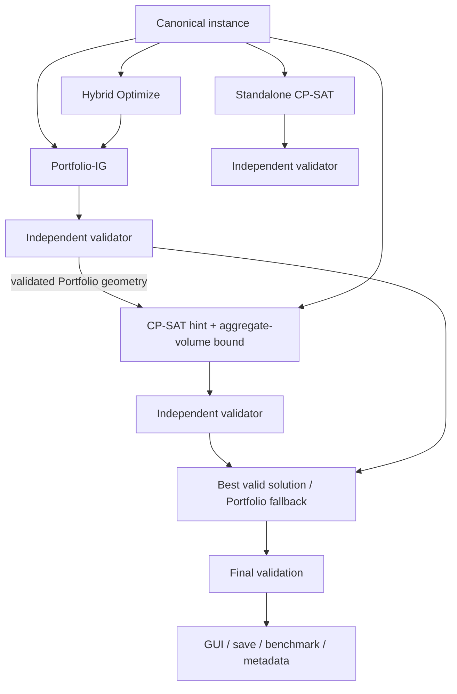

# Architecture

## Overview

The project separates canonical data, solver backends, orchestration, validation, presentation, and research. A solver is never its own correctness authority.

The standalone CP-SAT path and Hybrid path share the same model builder. Hybrid deliberately supplies a validated hint and enables the aggregate-volume inequality; the low-level cold CP-SAT defaults remain unchanged.

## Major module responsibilities

### Canonical data and validation

- `baseline_common.py` loads semantically valid canonical instances, expands physical box identities, builds canonical solutions, and provides non-overwriting JSON writes.
- `schemas/` contains the backend-independent versioned instance and solution JSON schemas.
- `validate_solution.py` independently verifies instance/solution identity, allowed orientations, realized dimensions, container bounds, pairwise non-overlap, packed volume, and utilization.

### Greedy path

- `Bin_packing_3D.cpp` contains the preserved historical placement engine plus deterministic policy modes and a machine-readable protocol.
- `greedy_baseline.py` converts canonical instances to that protocol, preserves physical IDs/type IDs/orientations, and converts output back to the canonical solution format.
- `greedy_portfolio.py` runs validated Greedy constituents sequentially. Portfolio-IG evaluates planar-inclusive and geometry-first; Portfolio-HIG additionally evaluates historical. Selection is maximum validated packed volume with a fixed tie priority.

### Exact and Hybrid paths

- `cpsat_baseline.py` owns the canonical OR-Tools CP-SAT formulation, solution extraction, solver-status semantics, optional solution hints, and opt-in aggregate-volume tightening. Research switches default off.
- `hybrid_optimizer.py` runs/accepts Portfolio-IG, validates it, uses it as a CP-SAT hint with the aggregate-volume bound, validates the CP-SAT candidate, selects the better valid result, and validates the final selection.
- `run_solver.py` is the common single-instance baseline CLI. Direct cold CP-SAT and the historical Greedy baseline remain available for reproducibility and backend use.

### Benchmark and external data infrastructure

- `benchmark.py` executes the internal suite, captures runtime/status/bound/validation metadata, records Git provenance, and refuses to overwrite runs.
- `benchmarks/distributional/` contains fixed-seed generated instances and their generation manifest.
- `benchmarks/external/orlib_br/adapter.py` strictly parses authoritative BR text files and converts them to canonical instances without changing quantities or orientation permissions.
- `external_br_benchmark.py` runs the external evaluation plan and records canonical solutions and paired summaries.
- Research runners (`greedy_*benchmark.py`, `cpsat_*experiment.py`, `*_audit.py`, and `hybrid_optimize_experiment.py`) isolate controlled experimental factors and write non-overwriting result directories.

### Desktop application

- `gui/models.py` converts form data to canonical instances, invokes existing backend/orchestration APIs, formats user-facing results, and exposes only independently valid solutions for visualization.
- `gui/worker.py` runs solver work in a Qt thread-pool worker and reports status, success, or failure through signals; it does not touch widgets.
- `gui/main_window.py` owns Fast/Optimize/Compare controls, lifecycle state, result hierarchy, visualization selection, and canonical solution/metadata saving.
- `gui/visualization.py` renders only the canonical solution selected by `gui.models.visualizable_solution`.

### Future learning infrastructure

- `learning/` extracts deterministic physical features, enumerates committed benchmark families, performs explicit label joins and deterministic splits, and exports research datasets. It has no solver integration and no trained model.

## Architectural invariants

1. The canonical solution schema is backend-independent.
2. Backend/search/runtime details belong in metadata or sidecars, never as silent schema extensions.
3. Every user-facing solver output is independently validated.
4. Portfolio constituents validate before portfolio selection.
5. Hybrid validates Portfolio before using it as a fallback or hint.
6. Hybrid validates the CP-SAT candidate before selection.
7. Hybrid validates its selected final output again.
8. `FEASIBLE` is a valid incumbent, not proof of optimality; only `OPTIMAL` is proven optimal.
9. Research switches remain default-off in low-level production APIs.
10. Historical Greedy behavior remains available for reproducibility.
11. With a valid Portfolio fallback, Hybrid selects CP-SAT only for strictly greater validated packed volume; exact ties retain Portfolio.
12. Learning outputs cannot bypass canonical geometry or the independent validator.

## Failure semantics

| Condition | Behavior |
|---|---|
| One Greedy constituent fails or is invalid | Exclude it; another valid constituent can still win. |
| Every Portfolio constituent fails/is invalid | Raise a Portfolio failure with constituent diagnostics. |
| CP-SAT `UNKNOWN` or no incumbent | No canonical CP-SAT solution exists to validate; Hybrid retains valid Portfolio. |
| CP-SAT exception | Hybrid records the error and retains valid Portfolio. |
| CP-SAT returns an invalid solution | Reject it and retain valid Portfolio. |
| CP-SAT is valid but worse or tied | Retain Portfolio; ties use the explicit deterministic tie policy. |
| Portfolio fails but CP-SAT returns a valid solution | Hybrid may return CP-SAT, but the Portfolio dominance invariant is unavailable and metadata says so. |
| Portfolio and CP-SAT both fail or are invalid | Raise `HybridOptimizerFailure`; the GUI clears stale results and reports total failure. |
| Standalone CP-SAT `INFEASIBLE`/`MODEL_INVALID` | Preserve the solver status; do not construct or validate a fake empty solution. |

A valid Portfolio fallback is normal successful degradation, not a GUI error.

## Runtime boundaries

Greedy metadata distinguishes the narrow C++ placement timer from adapter/process/validation end-to-end time. CP-SAT core time is `CpSolver.WallTime()`. GUI Optimize time configures the CP-SAT search budget; Portfolio construction, model setup, extraction, validation, and orchestration add surrounding wall time. When Compare reuses a Portfolio candidate, its original Fast runtime is recorded only when supplied; otherwise it remains `null`. Current-run reuse validation/orchestration time and incremental Hybrid time are recorded separately, so missing historical runtime is never fabricated.

## Extension points

### Add a Greedy heuristic

Implement a named deterministic policy behind the existing C++ protocol, preserve canonical identity and allowed orientations, add focused equivalence/correctness tests, and expose it first as a research constituent. Do not change Portfolio-IG without a separate controlled decision.

### Add another exact solver or formulation

Accept a `CanonicalInstance`, return canonical solution plus sidecar metadata, preserve honest status semantics, and independently validate before presentation. Keep formulation changes explicit and fingerprinted so experiments compare like with like.

### Add another benchmark family

Commit or deterministically generate canonical instances, record source/generation provenance and licenses, define stable IDs, and add manifest-integrity tests. Generated run outputs should remain non-overwriting and normally ignored.

### Add a learned predictor

Use `learning/` named physical features and an explicit label manifest. Evaluate against trivial baselines before integration. A predictor may allocate compute or rank policies, but it must not make unvalidated geometry authoritative.

### Add another GUI solver mode

Keep solver work in `gui.worker`, backend calls in `gui.models`, and widget state in `gui.main_window`. Give the mode a plain-language purpose, reuse canonical input, expose only validated output, save metadata separately, and define failure/fallback behavior in tests.

## Research and historical boundaries

The manual symmetry and incompatibility studies remain research-only or closed directions; their controls are not GUI modes. Historical outputs are governed by `historical_artifacts.md`. The unfinished reinforcement-learning notebook is preserved but is not part of this architecture's validated solver stack.
